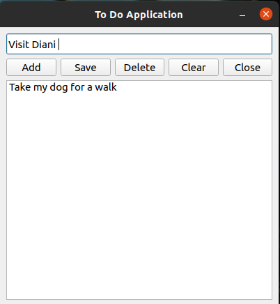

# Simple To Do List Desktop App
This is a simple PyQt5 desktop to do list application that works like the standard to do list apps.

## Technologies
1. Git 2.25.1 - Tool used for version control.
2. Python 3.8.10 - Main language used to write the application logic.
3. PyQt5 5.15.4 - Desktop user interface library based on C++ Qt framework.

## Installation
1. Download and install Git from [Git website](https://git-scm.com/book/en/v2/Getting-Started-Installing-Git)
2. Download and install Python from [Python website](https://docs.python-guide.org/starting/installation/)
3. Clone this repository in the terminal or commandline using the following command:
`git clone https://github.com/jkariukidev/simple_to-do_list.git`
   
4. Open the cloned folder using the commandline/terminal and enter the following command:
`pip install -r requirements.txt`
   
5. Run the to do list app by executing the python file
[to_do_list.py](./to_do_list.py)
   
6.The app should appear as shown below.
  

### Examples of use
1. This app can be used to learn on how to code in Python and PyQt.
2. The app can be used to store to do list of items for future reference.
3. This app can be used to store information in a light-weight database.

### Reference sources
1. RealPython website - [Real Python](https://realpython.com/)
2. PyQt Documentation - [PyQt Documentation](https://www.riverbankcomputing.com/software/pyqt/)